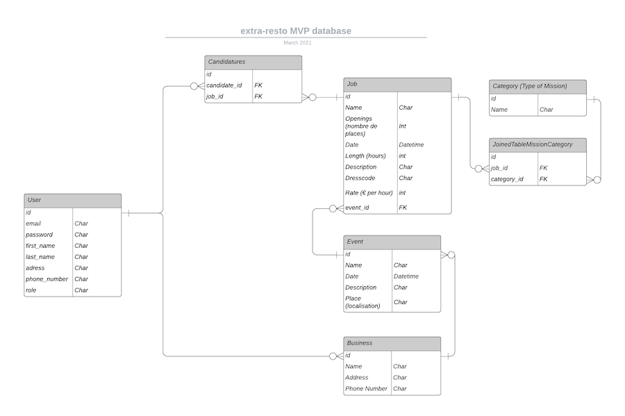

# extra-resto API (MVP)

## The project

This project is a  dummy F&B temporary job platform, coded during THP Next bootcamp 2021.
This repository hosts the dedicated client app.
It works in pair with its own [API](https://github.com/extra-resto/extra-resto-API)

The app allows business owners to post events, and fill their staff needs, and candidates to seek and apply to jobs.

## Database structure

  

## Accesses

|Role|Email|Password                                                  
|-|-|-|
| `Admin` | admin@test.fr | azerty     
| `Employer` | employer@test.fr |azerty
| `Candidate` |candidate@test.fr |azerty

## Try the app: [extra-resto.fr](https://www.extra-resto.fr)

## Tech

- [Next.js](https://github.com/vercel/next.js)
- [React](https://github.com/facebook/react)
- [Node Sass](https://github.com/sass/node-sass)

## Potential Improvements

## Contributors

- [:cactus: Dylan Pecqueux](https://github.com/dylan-pecqueux)
- [:deciduous_tree: Stephen Toulouse](https://github.com/stephen2790022)
- [:evergreen_tree: Gaëtan Altier](https://github.com/Badgaga23)
- [:seedling: Mathieu Joly](https://github.com/mathieu-superpose)
